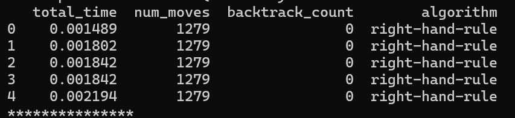
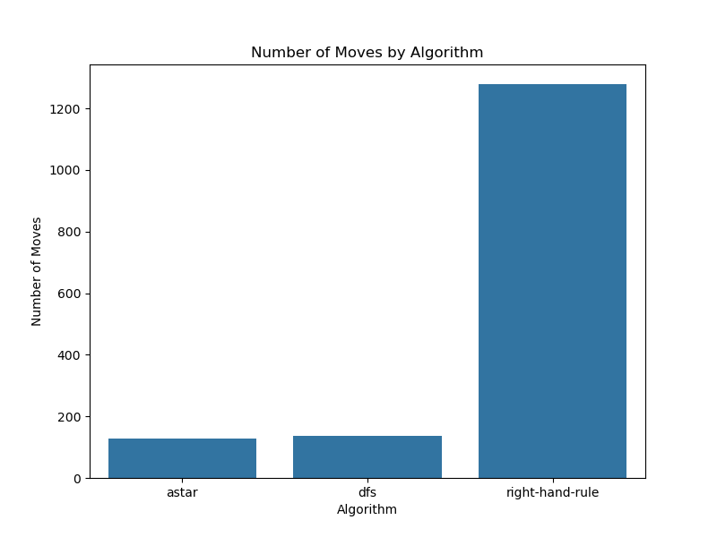

## Student Questions

### Question 1 (10 points)
Explain how the automated maze explorer works. Your answer should include:
1. The algorithm used by the explorer
2. How it handles getting stuck in loops
3. The backtracking strategy it employs
4. The statistics it provides at the end of exploration

To answer this question:
1. Run the explorer both with and without visualization
2. Observe its behavior in different maze types
3. Analyze the statistics it provides
4. Read the source code in `explorer.py` to understand the implementation details

Your answer should demonstrate a clear understanding of:
- The right-hand rule algorithm
- The loop detection mechanism
- The backtracking strategy
- The performance metrics collected

    The Algorithm Used by the explorer is the right-hand rule. How it works is as follows: 
    <ul style="color:#005A9C; font-weight:600">
        <li>The Robot will always hug the right side of the wall and will prefer going right over going straight or going left</li>
        <li>If the robot cannot go right, it will prefer going straight over going left</li>
        <li>If the robot cannot go straight as well, it will go right</li>
        <li>If none of the other options are available, aka if the robot has been stuck in the same place for the last three moves, the robot will "backtrack".</li>
    </ul>

### Question 2 (30 points)
Modify the main program to run multiple maze explorers simultaneously. This is because we want to find the best route out of the maze. Your solution should:
1. Allow running multiple explorers in parallel
2. Collect and compare statistics from all explorers
3. Display a summary of results showing which explorer performed best

*Hints*:
- To get 20 points, use multiprocessing.
- To get 30 points, use MPI4Py on multiple machines.
- Use Celery and RabbitMQ to distribute the exploration tasks. You will get full marks plus a bonus.
- Implement a task queue system
- Do not visualize the exploration, just run it in parallel
- Store results for comparison

**To answer this question:** 
1. Study the current explorer implementation
2. Design a parallel execution system
3. Implement task distribution
4. Create a results comparison system

    The components used for Parallelization is as follows:
    <ul style="color:#005A9C; font-weight:600">
        <li>MPI4PY: MPI4PY is used to spawn multiple machines, where rank 0 is the manager machine, and all other ranks are worker machines. The worker will be responsible for data collection and storage, while all other machines will be responsible for playing the game and collecting results.</li>
        <li>RabbitMQ, Celery, and Redis: RabbitMQ acts as a middleman between the Program and Celery. The program stores tasks that are to be executed onto RabbitMQ, and celery picks up tasks to execute from RabbitMQ. You will notice that if you run the program without running celery, the program will be stuck busy waiting (could depend on the implementation as well) till celery comes, picks up tasks from RabbitMQ, and completes them.</li> 
        <li>The results are stored in a csv file for further processing by worker (rank 0)</li>
        <li>These components will fit together to create a distributed system</li>
    </ul>

### Question 3 (10 points)
Analyze and compare the performance of different maze explorers on the static maze. Your analysis should:

1. Run multiple explorers (at least 4 ) simultaneously on the static maze
2. Collect and compare the following metrics for each explorer:
   - Total time taken to solve the maze
   - Number of moves made
   - *Optional*:
     - Number of backtrack operations

3. What do you notice regarding the performance of the explorers? Explain the results and the observations you made.

    Because we are using a deterministic algorithm (right-hand-rule) that does the same thing every and the maze is static, we are getting same results from each worker.

    

### Question 4 (20 points)
Based on your analysis from Question 3, propose and implement enhancements to the maze explorer to overcome its limitations. Your solution should:

1. Identify and explain the main limitations of the current explorer:

2. Propose specific improvements to the exploration algorithm:

3. Implement at least two of the proposed improvements:

Your answer should include:
1. A detailed explanation of the identified limitations
2. Documentation of your proposed improvements
3. The modified code with clear comments explaining the changes

    The current limitation is the algorithm implemented, which is the right-hand-rule. Although relatively simple to implement, the search space for the robot is exhastive. 

    We want to find the shortest path between the start point and the end point while avoid obstacles. This is a path-finding problem, and hence to solve this we will use search algorithms. Some Examples of Search Algorithms Include Breadth First Search (BFS), Depth First Search (DFS), and A* Algorithm [1].

    These two classes of algorithms -- Uninformed for BFS, DFS, and dijkstra, and Informed Algorithms both have their advantages and shortcomings.
    Uniformed Search Algorithms are one which doesn’t have any additional information about the problem other than the problem definition and the solution intended. The uninformed search is also known as the blind search as it only knows about its current state and all states which are reachable from that state. 
        <ul style="color:#005A9C; font-weight:600">
            <li>Right-Hand Rule - This algorithm follows walls without knowing where the exit is</li>
            <li> Depth First Search(DFS) - Uses a Stack, Does not explores a point full, prefers exploration over exploitation.</li>
        </ul>
    Informed Search Algorithm uses a heuristic function to be more biased towards the goal. I used A* algorithm with cost function  (both euclidean and manhattan distance). Results will be presented in the next section.

### Question 5 (20 points)

Compare the performance of your enhanced explorer with the original:
   - Run both versions on the static maze
   - Collect and compare all relevant metrics
   - Create visualizations showing the improvements
   - Document the trade-offs of your enhancements
Your answer should include:
1. Performance comparison results and analysis
2. Discussion of any trade-offs or new limitations introduced

    I ran the algorithm on the original right-hand rule, and then with the newly implemented DFS and A* algorithm

    

    A* Algorithm performed the best with solving the maze in 127 moves, followed by DFS, and last the right-hand rule.

    The original right-hand rule algorithm can be considered simplistic in nature. It's a very intuitive approach to solving the maze search problem. However it often gets stuck in loops. DFS can suffer from this same problem. A* algorithm because of its use of additional cost function helps guide the search efficiently, however for larger mazes, it could be memory intensive. I still need to test these claims, right now, i am just writing what intuitively makes sense to me.

### Final points 6 (10 points)
1. Solve the static maze in 150 moves or less to get 10 points.
2. Solve the static maze in 135 moves or less to get 15 points.
3. Solve the static maze in 130 moves or less to get 100% in your assignment.

| num_moves | algorithm       |
|-----------|-----------------|
| 127       | astar           |
| 137       | dfs             |
| 1279      | right-hand-rule |

    A* algorithm resulted in the fastest solution of 127 Moves

### Bonus points
1. Fastest solver to get top  10% routes (number of moves)
2. Finding a solution with no backtrack operations
3. Least number of moves.

# References

[1] Kaur, N. K. S. (2019). A review of various maze solving algorithms based on graph theory. IJSRD, 6(12), 431-434.
